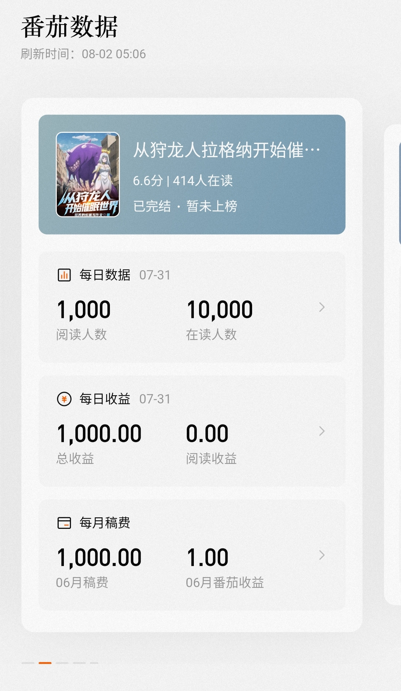

# FanqieShow

> 番茄作家助手（com.bytedance.writer_assistant_flutter）LSPosed 模块：**等级自由切换 + 作品数据展示自定义**
> 仅修改本机展示层，不篡改服务器数据。

[](https://github.com/giaoimgiao/fanqieshow/releases)
[](https://github.com/giaoimgiao/fanqieshow/actions)

---

## 功能特性

### 🏆 等级自由切换（v2.6 核心）

真实等级由服务端接口 `app/home/account/info/v0/` 下发的两个字段决定：

| 字段 | 含义 | 示例 |
|---|---|---|
| `point` | 当前等级分 | 726 → **200000** |
| `author_level_id` | 当前等级 ID | 200（Lv.1）→ **432（Lv.5）** |

模块伪造这两个字段后，App **自行匹配 level_config 等级表**，自动切换对应等级的卡片、配色、权益与进度条——不做任何卡片/文本的硬替换，界面逻辑完全由 App 原生驱动。

支持目标等级（`level=` 配置）：

| 配置值 | 等级 | ID | 等级分 |
|---|---|---|---|
| 0 | Lv.0 | 100 | 0 |
| 1 | Lv.1 | 200 | 500 |
| 2 | Lv.2 | 300 | 2000 |
| 3 | Lv.3 | 400 | 6000 |
| 4 | Lv.4 | 416 | 16000 |
| 5 | **Lv.5** | 432 | 200000 |
| 6 | 金番作家（签约制） | 500 | 200000 |
| 7 | 殿堂作家（签约制） | 600 | 200000 |

> 等级阈值（服务端下发确认）：Lv.2=2000 / Lv.3=6000 / Lv.4=16000 / Lv.5=106000；金番/殿堂为官方签约制，无等级分，直接改 ID 指向。

### 📊 作品数据展示自定义

| 页面 | 字段 | 接口 |
|---|---|---|
| 作品页 | 每日收益 `last_daily_income` | book_common |
| 作品页 | 阅读人数 `last_read_count` | book_common |
| 作品页 | 在读人数 `last_reader_uv_14day_count` | book_common |
| 作品页 | 月度稿费 `last_monthly_income` | book_common |
| 作品列表 | 阅读人数 `read_count` | book_list |

## 效果截图

**等级页 / 我的页 —— Lv.5 金色卡片 + 等级分 200000**


**作品数据页 —— 收益/阅读/在读/月稿费自定义**



---

## 技术原理

- **注入点**：字节系 App 统一使用 ttnet Cronet 网络栈，hook 应用层最终回调 `VersionSafeCallbacks$UrlRequestCallback.onReadCompleted`，获取响应 ByteBuffer 后改写，天然兼容 Flutter 架构（libapp.so Dart AOT 字符串加密，静态分析不可行，网络层改写为最优解）。
- **等级分溯源**：等级分不在 level_config / user/info / growth_task 等已记录接口中，最终定位到 `account/info` 响应：`point`（等级分）+ `point_detail`（创作分/成长分/稿费分/附加分明细）。
- **Buffer 语义**：改写采用 `clear()+put()` 且**不调用 flip()**——Cronet 回调时 buffer 语义为 position=写入量，应用自行 flip 后读取。
- **溢出保护**：替换后数据超过 buffer 容量时自动放弃改写，杜绝 `BufferOverflowException` 导致的"网络错误"。
- **配置热更新**：每次响应前实时重载 `fanqieshow.conf`，修改配置即时生效，无需重启 App。

## 环境要求

| 项 | 要求 |
|---|---|
| 系统 | Android 10+（已验证 Android 11 / MIUI 12.5） |
| 框架 | Magisk（Zygisk）+ LSPosed / LSPosed Kitsune |
| 目标 | 番茄作家助手 4.6.5（com.bytedance.writer_assistant_flutter） |

## 安装

1. 从 [Releases](https://github.com/giaoimgiao/fanqieshow/releases) 下载最新 APK（GitHub Actions 云构建，固定 debug 签名）
2. LSPosed 管理器 → 模块 → 启用 FanqieShow → 勾选作用域：番茄作家助手
3. 重启番茄进程（或重启手机）
4. 编辑配置文件（见下）

## 配置

配置文件路径（优先级从高到低）：

1. `/data/data/com.bytedance.writer_assistant_flutter/files/fanqieshow.conf`（App 私有目录）
2. `/sdcard/Download/fanqieshow.conf`（root 环境下由同步脚本自动同步至私有目录）

```ini
# FanqieShow config
enabled=1            # 总开关（1/true 开启）
level=5              # 目标等级: 0~5=Lv.0~Lv.5, 6=金番作家, 7=殿堂作家
level_name=          # 等级名显示（可选，留空用 App 默认；非空时同时替换等级名文本）
readers=1000         # 阅读人数
reading=10000        # 在读人数
income=1000          # 每日收益
monthly=1000         # 月度稿费
```

## 版本历史

| 版本 | 说明 |
|---|---|
| v1.x | 网络监听、响应体抓取（UTF-8 修复、固定签名） |
| v2.x | 响应改写架构（flip 语义修复、配置热更新） |
| v2.3 | 等级名文本替换（仅文本，无法改变等级，已证伪） |
| v2.4 | 等级卡整卡样式替换（触发 buffer 溢出 → 网络错误，已弃用） |
| v2.5 | 溢出保护修复；定位等级分数据源 account/info |
| **v2.6** | **等级分 + 等级 ID 伪造，真正的等级切换** |

## 已知限制

- 仅展示层修改：不参与真实收益/等级计算，服务器数据不受影响
- 等级权益的实际使用（如 AI 工具次数等）以服务端校验为准
- 字节系风控存在，请勿用于任何违规场景

## 免责声明

本模块仅供**学习交流与个人展示**使用，不篡改服务器数据、不刷量、不作弊。使用造成的任何后果由使用者自行承担。请遵守番茄作家助手用户协议及相关法律法规。

## License

MIT
